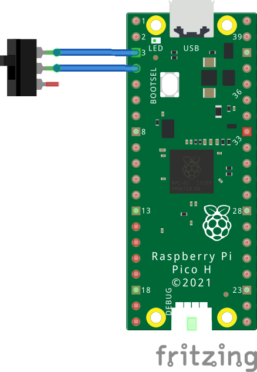
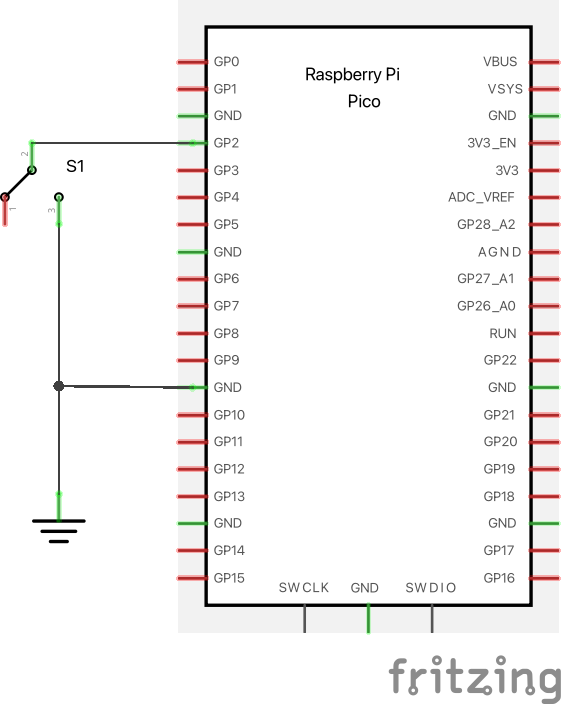
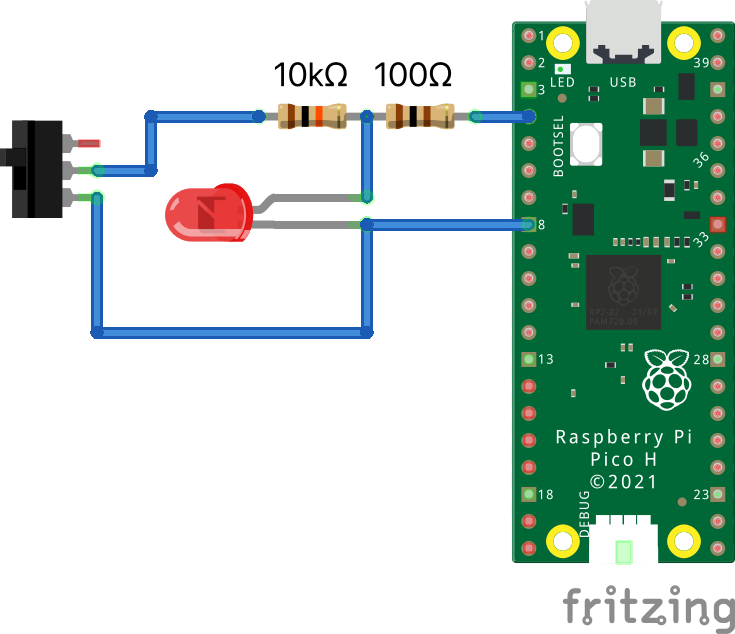
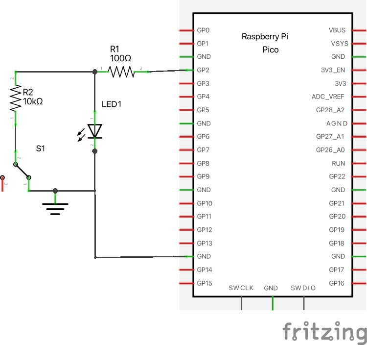

DebouncedPin
============

Automatic input button debouncing.

Buttons and other mechanical switches often generate rapid open/close signals when actuated.
Naively, a microcontroller may read these rapid open/closing signals as actual multiple button presses.
Button debouncing can be implemented either in hardware or in software; this module implements debouncing in software.

Dependencies
^^^^^^^^^^^^

No dependencies.

DebouncedPin
^^^^^^^^^^^^
Inherits from micropython's builtin ``machine.Pin``.

Typical usage:

.. code-block:: python

   from debouncedpin import DebouncedPin

   pin = DebouncedPin(2, DebouncedPin.PULL_UP)

   # Directly call the object to get the current state.
   value = pin()

   # Alternatively the value can be retrieved via the ``value`` method.
   value = pin.value()

To automatically execute a function when a change in switch state is detected, configure an interrupt:

.. code-block:: python

   from debouncedpin import DebouncedPin

   def handler(pin):
       print("Button was just pressed!")

   pin = DebouncedPin(2, DebouncedPin.PULL_UP)
   pin.irq(handler, DebouncedPin.IRQ_FALLING)

   while True:
       # Program can be doing other stuff here.
       pass

How It Works
~~~~~~~~~~~~
Every 20 milliseconds, the ``DebouncedPin`` object will poll the input pin state.
If 2 consecutive reads report the same value, the cached switch state is updated.
When the user wants to read the switch state, the cached switch state is returned.

DebouncedLedPin
^^^^^^^^^^^^^^^
Inherits from ``DebouncedPin``.
All ``DebouncedPin`` documentation also applies to this class.

``DebouncedLedPin`` can control an LED and read the state of a button using a single microcontroller pin.
Compared to a naive switch/LED circuit using 2 microcontroller pins, this setup requires an additional 10kΩ resistor.
Sharing a pin can be useful for reducing the number of IO required for a project.
If the led/switch are mounted elsewhere, this can also reduce the number of wires required in the cable.

.. code-block:: python

   from debouncedpin import DebouncedLedPin

   pin = DebouncedLedPin(2, DebouncedPin.PULL_UP)

   # Various ways to read the current switch state:
   value = pin()
   value = pin.value()

   # Various ways to turn on LED
   pin(True)
   pin.value(True)
   pin.on()

   # Various ways to turn off LED
   pin(False)
   pin.value(False)
   pin.off()

Signal
^^^^^^

The ``Signal`` class takes in a Pin-like object as input.
Optionally, set the ``invert=True`` flag to invert physical
input/output values.

The builtin ``machine.Signal`` class doesn't handle pin-like objects well.
However, this implementation won't be as fast/resource-efficient,
but that's fine for many cases.

If wrapping a vanilla ``machine.Pin`` object, it's recommended to use the
built in ``machine.Signal`` class. If wrapping an object that implements the pin Protocol, then use the ``Signal`` class implemented here.

.. code-block:: python

   from debouncedpin import DebouncedPin
   from signal import Signal

   pin = DebouncedPin(7)  # This won't work with ``machine.Signal``
   signal = Signal(pin, invert=True)  # If the output is active-low

   signal.on()  # Turn signal off, setting pin high
   signal.off()  # Turn signal off, setting pin low
   signal.value(True)  # alternative ways to turn signal on
   signal(True)

   val = signal()  # Read input; this also abides by ``invert``.
   val = signal.value()
How It Works
~~~~~~~~~~~~
In addition to the explanation of how ``DebouncedPin`` works, ``DebouncedLedPin`` will set the pin to be in an output configuration between pin input reads.
This results in the pin being in output for the majority of the time, turning the LED on or off.
For the very brief moment that the pin is changed to input mode, the LED will be off while the button state is read.
This brief moment where the pin is in input mode is imperceptable to the human eye.
