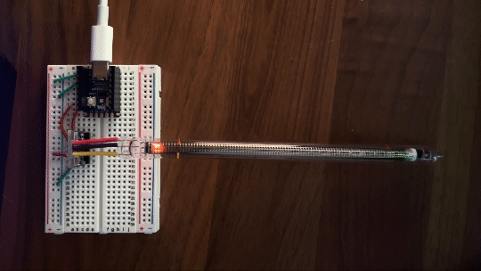

IN13
====
`IN13 Nixie Bargraph Indicator with I2C Driver Board <https://www.tindie.com/products/eclipsevl/in-13-bargraph-nixie-tube-with-driver-and-dc-dc/?pt=ac_prod_search>`_

Dependencies
^^^^^^^^^^^^

No dependencies.

IN13
^^^^
The ``IN13`` class uses a ``I2C`` object to handle communications:

.. code-block:: python

   from machine import I2C
   from in13 import IN13

   i2c = I2C(1, sda=Pin(26), scl=Pin(27), freq=400000)
   indicator = IN13(i2c)
   indicator.filter = 1.0  # Slowest reaction setting
   indicator.value = 0.72  # Set to 72% fill.
