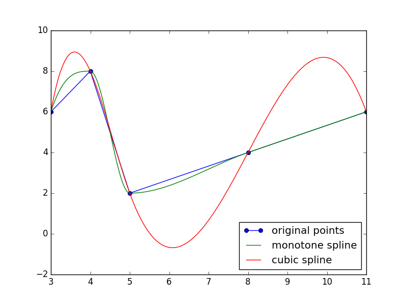

Interp1D
========
1D interpolation methods.

Dependencies
^^^^^^^^^^^^

No dependencies

Interpolater
^^^^^^^^^^^^
Base interpolater class.
Not to be directly instantiated.
All interpolaters have the same interface; linear interpolation is shown below as a demonstration:

.. code-block:: python

   import interp1d

   x = [1, 5, 17]  # Inputs
   y = [20, 6, 14]  # Outputs
   mapping = interp1d.Linear(x, y)
   mapping(11)  # 10.0

The input ``x`` array **must** be sorted.

By default, querying a value outside the range of input datapoints will raise a ``ValueError``.

.. code-block:: python

   mapping(18)  # raises ValueError

We can control this behavior with the ``fill_value`` argument by either specifying the string ``"clip"`` or by specifying a tuple of 2 floats representing ``(low, high)``:

.. code-block:: python

   import interp1d

   x = [1, 5, 17]
   y = [20, 6, 14]

   mapping = interp1d.Linear(x, y, fill_value="clip")
   mapping(0)  # 20
   mapping(18)  # 14

   mapping = interp1d.Linear(x, y, fill_value=(-100, 100))
   mapping(0)  # -100
   mapping(18)  # 100

Linear
^^^^^^
Linear interpolation.

Cubic
^^^^^
Cubic interpolation.

MonoSpline
^^^^^^^^^^
Monotone preserving cubic interpolation.
Unlike ``Cubic``, ``MonoSpline`` guarantees interpolated values to be in-between it's supporting points.

The above graphic comes from `antdvid's implementation`_, which this implementation is also based on.

searchsorted
^^^^^^^^^^^^
Not an interpolation function, but may be externally useful.
For a given sorted iterable, finds the index where a value should be inserted to maintain order.

.. code-block:: python

   data = [1, 5, 10]
   searchsorted(data, 0)  # 0
   searchsorted(data, 1)  # 0
   searchsorted(data, 2)  # 1
   searchsorted(data, 8)  # 2
   searchsorted(data, 11)  # 3

.. _antdvid's implementation: https://github.com/antdvid/MonotonicCubicInterpolation
